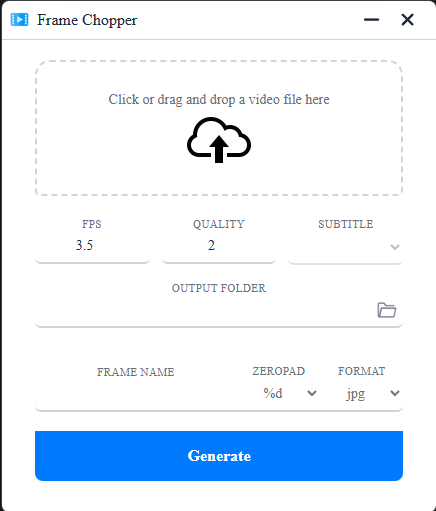

# Frame Chopper

<div align="center">

A graphical interface to extract frames from videos using FFmpeg.

[](https://github.com/JavaRaf/Frame-Chopper/releases/tag/v1.6)
[](LICENSE)



</div>

## Features

- **Easy to Use**: Simple drag-and-drop interface
- **Frame Extraction**: Extract frames at any FPS rate
- **Quality Control**: Adjustable quality for JPEG output
- **Multiple Formats**: Support for JPEG and PNG formats
- **Custom Naming**: Configure frame naming patterns with zero-padding
- **FFmpeg Powered**: Leverages the power of FFmpeg for video processing

## Requirements

- **Node.js**: 18 or higher
- **Electron**: Required for building
- **FFmpeg**: Required for video processing (included in releases)

## Installation

### From Release

1. Download the latest release from the [releases page](https://github.com/JavaRaf/Frame-Chopper/releases/tag/v1.6)
2. Install the application
3. Launch Frame Chopper

### From Source

```bash
# Clone the repository
git clone https://github.com/JavaRaf/Frame-Chopper.git
cd Frame-Chopper

# Install dependencies
npm install

# Build the application
npm run build
```

## Usage

1. **Select Video**: Choose a video file or drag and drop it into the application
2. **Configure Settings**:
   - **Frames Per Second**: Set how many frames to extract per second (1 = one frame per second)
   - **Quality**: Set JPEG quality (1 = best, 31 = worst). Note: PNG has no quality option
   - **Output Folder**: Specify where frames will be saved
   - **Frame Prefix**: Add a prefix to frame filenames
   - **Zero Padding**: Add leading zeros to frame numbers for easier sorting
   - **Format**: Choose between JPEG or PNG output format
3. **Extract**: Click to start the frame extraction process

## Building

```bash
npm install
npm run build
```

## License

This project is licensed under the [MIT LICENSE](LICENSE).


